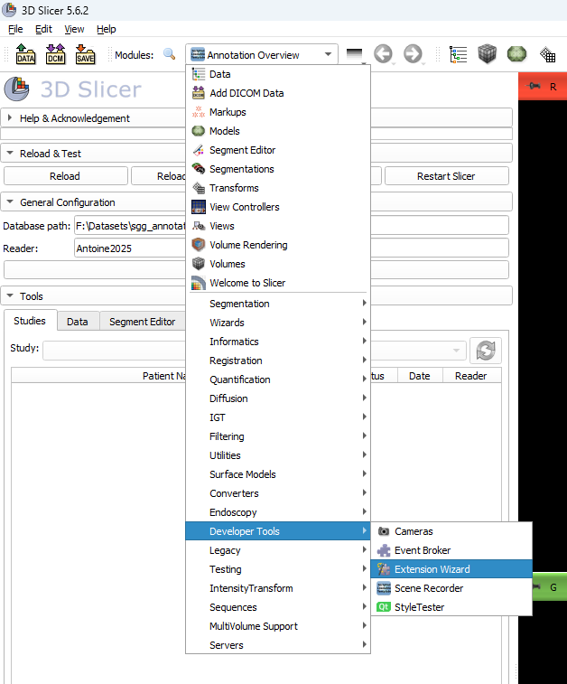
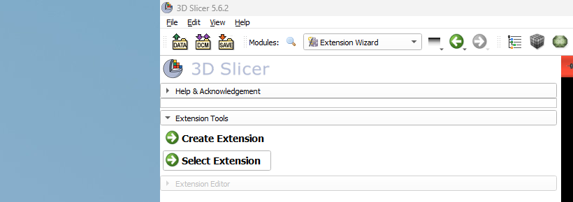
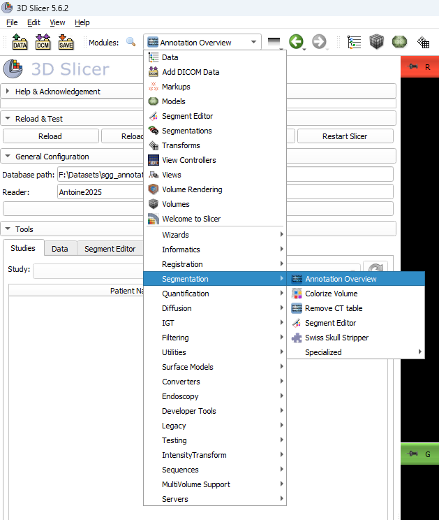
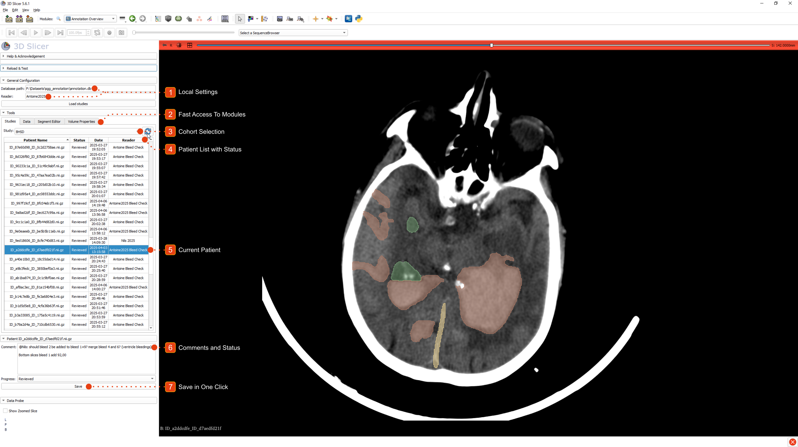

# 3D Slicer Modules

## AnnotationOverview

Currently our only module, it is designed to make the segmentation of a large cohort much easier.
In particular, we aimed at making data I/O as simple as possible. 
We also add some overview features to easily track the annotation progress of an entire cohort, especially by multiple people.
It only relies on a small local SQLite database. You won't have to do any SQL though!

### Installation

This module comes in two parts: a tiny Python library, and the actual 3D Slicer module. We'll go over how to install both.

To install the Python library, which serves as our backend, you can run to install a few dependencies:
```bash
pip install -e .
```

**Note:** this does not need to be Slicer's Python interpreter. This is completely independent.

Currently, our module is not available in the extension manager. So, we need to add the module ourselves:
- Open 3d Slicer
- Click the module list →  `Developper Tools`  → `Extension Wizard`

- Click `Select Extension`

- Select the path to the `3d-slicer-modules` folder.
- A pop-up will appear with a list of the detected modules. Just press `Yes`.

That's it! Our module is now added to the list.


**Note:** 3D Slicer version 5.6 or above is required.
**Note:** the `sqlite-utils` will automatically be installed on 3D Slicer's Python interpreter. 
This is not an issue unless, you're sitting behind a proxy (causes a timeout where Slicer is unresponsive).
It this case, please install this library yourself.
**Note:** 3D Slicer does not make a copy of the code that it imports. So any change in the code here will affect the in-app behavior.

### Preparing for Annotation

First, we need to set up the SQLite database and a new study. You won't have to do any SQL as we provide a few scripts to handle the most common operations.
Here is the folder structure for our example:
```
pwd/
├─ BHSD/
│  ├─ images/
│  ├─ segmentations/
```

`pwd` is our current working directory, where we have a folder for the `BHSD` dataset, with two subfolders for images and future segmentations.
`segmentations` can be empty or have existing masks (e.g. pre-segmentations produced by a Deep Learning model).

**Step one:** we create a database file. For instance:
```bash
sgann_database_rebuild -d my_database.sql
```

**Note:** this operation might fail if your destination is on a network drive. In this case, first do everything locally and then move all files it to the network drive.

**Step two:** create a new study. For more information about the different options, please read the help message. Here is what we did to annotate one of our datasets:
```bash
sgann_study_add -d my_database.sql --name BHSD --image-folder BHSD/images --label-folder BHSD/segmentations --segments VentricleSystem Midline ICH --last-segment-can-repeat --window-center 50 --window-width 100
```
A study id will be displayed, it will be useful for later. If you forgot it, you can run the `sgann_study_list` script.

Keep in mind that you only have to do it once. But here is what you need to remember:
- All paths are stored relatively to the database file. This is made so that everything can be copied/moved without any issue.
Even a network drive mounted at different locations, on different PCs is not an issue.
- You have to list the segment classes that you expect, this is purely cosmetic but makes annotating much easier.
- The window center/width is optional but allows automatically adjusting the value window when loading a new image.

**Note:** Currently, only semantic segmentation is supported. 
To enable a more flexible setup, we can optionally allow any additional segment to map to the last segment defined.
Supporting true instance segmentation is a work in progress.

**Step three:** automatically detect all images present in the folders we just defined:
```bash
sgann_study_progress_update -d my_database.sql --study-id 1 --progress-new 0 --lost-folder BHSD/lost
```

A few comments:
- Any existing segmentation mask will be automatically paired with their corresponding image. Otherwise, an empty mask will be created.
- Since we track the annotation progress, we need to set the progress of any new image detected. Check the help message to see what the values mean.
- The script might find a segmentation mask with no matching image. Instead of deleting it, we move it to the lost folder.

## Using our AnnotationOverview Module

If you find the previous instructions tedious, I do too. But we only have to do it once for each cohort, and then we can forget about it.
Also if you're working with doctors, then no worries. They don't need to know about any of the previous stuff.

**Last step:** select our `AnnotationOverview` module in 3D Slicer. In the `General Configuration` panel, paste the absolute path to the database file. 
Then type your name in the box underneath and click `Load studies`. If you did not have any error pop-up, then that's it!

**Note:** after a successful connection, these two parameters are saved and automatically loaded again if you re-open Slicer.

## Overview of the AnnotationOverview Module



Here is a quick summary of the features:
1. Local settings. You already know what they do.
2. Fast access to modules. Switching modules can be annoying in Slicer. So we added tabs to easily switch between them.
3. Cohort selection. You will find all studies defined in the database in this list. Selecting one will automatically update the patient list.
4. Patient list. It gives a fast overview of the progress for all images. You can sort by patient name, progress status or last update date.
5. Patient selection. Clicking a row will do the following:
   - load the image
   - adjust the value window
   - load the corresponding segmentation
   - select it as the current segmentation in the `Segment Editor` module
   - rename the segments
6. Comments and status. You can also add a comment for each patient, which is then stored in the database.
So feel free to leave comments or questions for your colleagues.
7. Save button. Click this button to save the segmentation/comment/status. That's it!


There are also a few keybinds:
- E: select the previous patient
- F: select the nex patient
- S: as if you clicked the save button

**Note:** if you attempt to select another patient without saving changes, then you will egt a waning pop-up.
