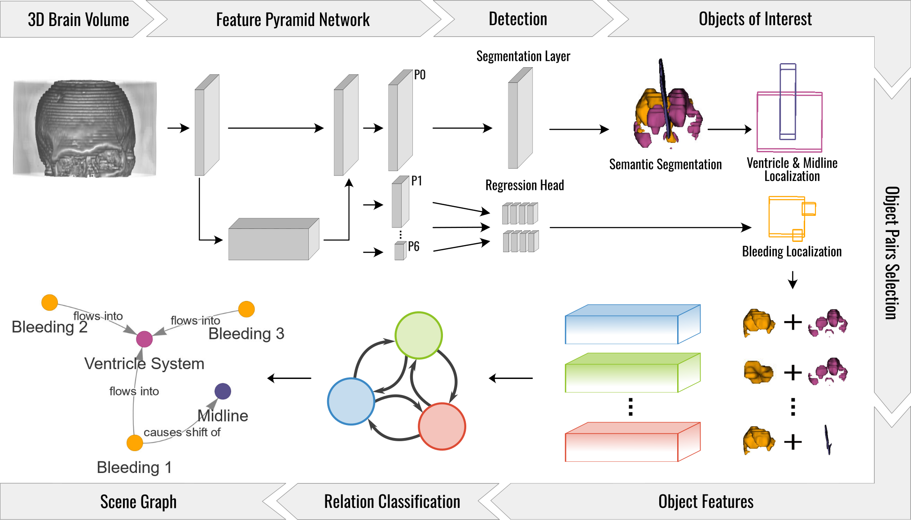
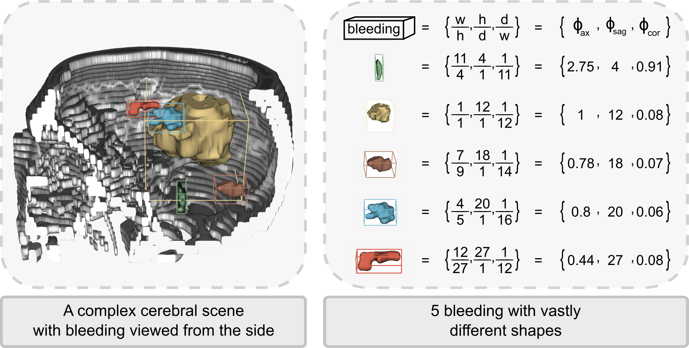

# Voxel Scene Graph

This is our central hub for all our work on Voxel Scene Graph. It is still a WIP and fancy illustrations may come in
the future. Anyway here is an overview of the repository that you can find here:

- `pycocotools3d`: object detection evaluation for 3d bounding boxes and MS COCO format abstractions
- `scene-graph-api`: data structures and abstractions to bridge data annotation and Deep Learning applications
- `scene-graph-prediction`: framework for Voxel Scene Graph applications
- `scene-graph-annotation`: tool for Voxel Scene Graph annotation and much more (TBA) 😉
- `federated-scene-graph-prediction`: framework for Voxel Scene Graph applications trained 
using Federated Learning (TBA) 😉

## Our Accepted Papers

### Voxel Scene Graph for Intracranial Hemorrhage



This paper has been **accepted at [MICCAI2024](https://conferences.miccai.org/2024/en/)**.
To the best of our knowledge, this is the first application of Scene Graph to voxel data.
In particular, we show how only detecting Intracranial Hemorrhage is clinically insufficient, 
as bleedings interact with neighboring brain structures, potentially causing deadly complications.
Scene Graphs can capture the entire clinical cerabral scene and model these complex relations.
You can find the pre-print **[here](https://arxiv.org/abs/2407.21580)**:
```
Sanner, A. P., Grauhan, N. F., Brockmann, M. A., Othman, A. E., & Mukhopadhyay, A. (2024). 
Voxel Scene Graph for Intracranial Hemorrhage. arXiv [Cs.CV]. Retrieved from https://arxiv.org/abs/2407.21580
```

### Detection of Intracranial Hemorrhage for Trauma Patients



This paper has been **accepted at [ICPR2024](https://icpr2024.org/)**. 
It focuses on the challenges of Intracranial Hemorrhage detection
in voxel data, and introduced the novel VC-IoU loss for bounding box regression. 
You can find the pre-print [here](https://www.arxiv.org/abs/2408.10768):
```
Sanner, A. P., Grauhan, N. F., Brockmann, M. A., Othman, A. E., & Mukhopadhyay, A. (2024). 
Detection of Intracranial Hemorrhage for Trauma Patients. arXiv [Cs.CV]. 
Retrieved from http://arxiv.org/abs/2408.10768
```

