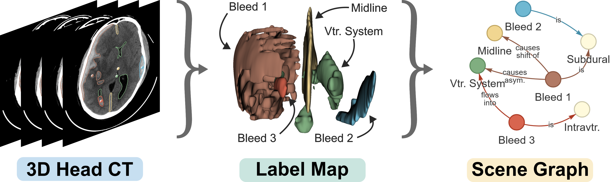
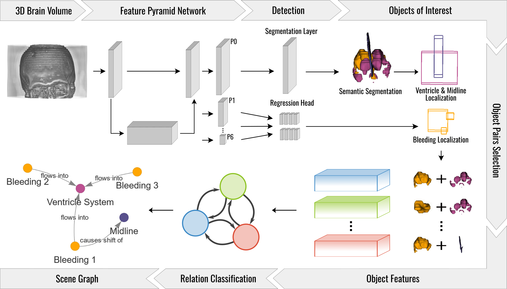
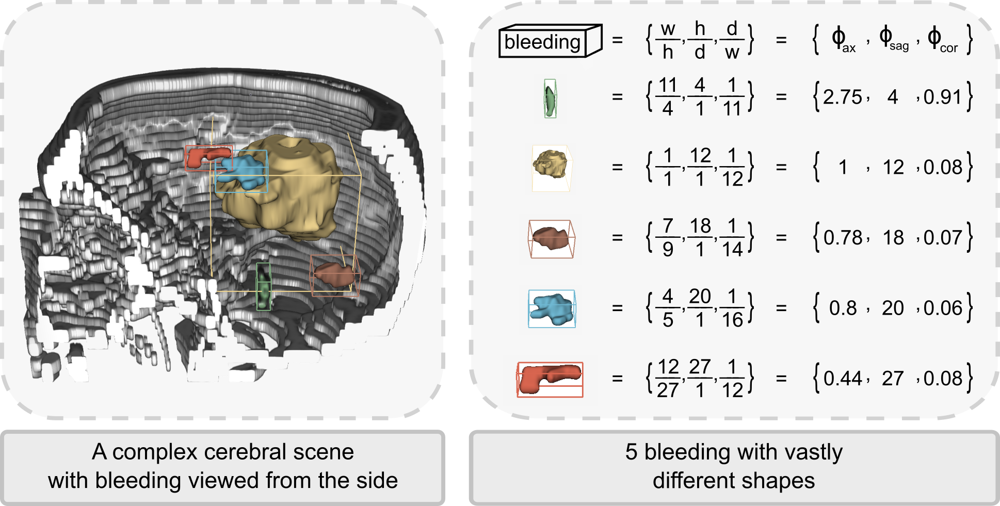

# 🧠 Voxel Scene Graph

This is our **central hub** for all our work on **Voxel Scene Graphs** of 3D medical images that combine object detection, segmentation, and relational reasoning.
It includes datasets, annotation tools, and learning frameworks for research on structured reasoning in 3D medical imaging, with a focus on Intracranial Hemorrhage (ICH).

## 🚀 Where to Start?

New to the project? Here’s how to get started quickly 👇

### 🗂️ 1. Download the Data

Our annotated dataset **BleedScene3D** is openly available on [Kaggle](https://www.kaggle.com/datasets/sannera/bleedscene3d). It includes **574 annotated volumes** from multiple open datasets with harmonized scene graph annotations.
> **Note:** The dataset will be made public upon acceptance of our IEEE TMI submission. Until then, you can still explore the API and tools locally.

### 🧩 2. Load our Scene Graphs with Python

Use our `scene-graph-api` library to open, and manipulate scene graphs. It contains all the necessary data structures to inspect data and serves as a bridge between data annotation and Deep Learning experiments.
The [README](https://github.com/MECLabTUDA/VoxelSceneGraph/tree/main/scene-graph-api) will guide through the installation process.

### 🎨 3. Visualize our Scene Graphs

Visualizing 3D Scene Graphs requires specialized tools. Thankfully, our annotation tool also provides intutive UI to visually inspect the annotated ground truth.
Installation isntructions are available [here](https://github.com/MECLabTUDA/VoxelSceneGraph/tree/main/scene-graph-annotation).

### 🖋️ 4. Annotate or Extend the Dataset

If you already went through the previous step, then you are already famiiar with our Scene Graph annotation tool.
To fully annotate new images, you will first have to localize objects first.
Our 3D Slicer [extension](https://github.com/MECLabTUDA/VoxelSceneGraph/tree/main/3d-slicer-modules) can help you streamline this process.

> 💬 **Having trouble configuring our tools?** Feel free to reach out or open a GitHub issue!

> 📘 Detailed annotation protocols for our datasets are also available on [Kaggle](https://www.kaggle.com/datasets/sannera/bleedscene3d).

### 🧠 5. Train and Evaluate Models

For training Scene Graph Generation (SGG) or detection models:
- Use the `scene-graph-prediction` [library](https://github.com/MECLabTUDA/VoxelSceneGraph/tree/main/scene-graph-prediction) for centralized training.
- Or use the `federated-scene-graph-prediction` [library](https://github.com/MECLabTUDA/VoxelSceneGraph/tree/main/federated-scene-graph-generation) for privacy-preserving Federated Learning setups.

Each framework comes with ready-to-run configs reproducing our published experiments.

## 📦 Repository Overview

| Module                             | Purpose                                                                         |
| ---------------------------------- | ------------------------------------------------------------------------------- |
| `pycocotools3d`                    | Evaluation for 3D object detection and MS-COCO-style abstractions               |
| `scene-graph-api`                  | Core data structures and I/O for scene graphs                                   |
| `scene-graph-prediction`           | Centralized framework for Scene Graph Generation                                |
| `federated-scene-graph-prediction` | Federated training framework for privacy-preserving VSG                         |
| `theoden`                          | Fork of [TheODen](https://github.com/MECLabTUDA/TheODen) for federated learning |
| `3d-slicer-modules`                | Extensions to streamline segmentation and cohort annotation                     |
| `scene-graph-annotation`           | Standalone GUI tool for relation and attribute annotation                       |

## Our Accepted Papers

### Federated Voxel Scene Graph for Intracranial Hemorrhage


This paper has been **accepted at [WACV2025](https://wacv2025.thecvf.com/)**.
To the best of our knowledge, this is the first application of Federated Learning to Scene Graph Generation of any kind.
For this paper, we had to gather publicly available datasets with head CTs of ICH patients from around the world.
We then **curated** and **annotated** these, which allowed to have **~450 annotated images** 
(compared to the ~150 from the MICCAI paper).
In this paper, we not only show that models trained centrally on a single dataset fail to generalize to other datasets,
but that Federated Learning allows bridging this gap without breach of data privacy.
You can find the pre-print **[here](https://arxiv.org/abs/2411.00578)**:
```
Sanner, A. P., Stieber, J., Grauhan, N. F., Kim, S., Brockmann, M. A., Othman, A. E., & Mukhopadhyay, A. (2024). 
Federated Voxel Scene Graph for Intracranial Hemorrhage. arXiv [Cs.CV]. Retrieved from https://arxiv.org/abs/2411.00578
```



This paper has been **accepted at [MICCAI2024](https://conferences.miccai.org/2024/en/)**.
To the best of our knowledge, this is the first application of Scene Graph to voxel data.
In particular, we show how only detecting Intracranial Hemorrhage (ICH) is clinically insufficient, 
as bleedings interact with neighboring brain structures, potentially causing deadly complications.
Scene Graphs can capture the entire clinical cerebral scene and model these complex relations.
You can find the pre-print **[here](https://arxiv.org/abs/2407.21580)**:
```
Sanner, A. P., Grauhan, N. F., Brockmann, M. A., Othman, A. E., & Mukhopadhyay, A. (2024). 
Voxel Scene Graph for Intracranial Hemorrhage. arXiv [Cs.CV]. Retrieved from https://arxiv.org/abs/2407.21580
```

### Detection of Intracranial Hemorrhage for Trauma Patients



This paper has been **accepted at [ICPR2024](https://icpr2024.org/)**. 
It focuses on the challenges of Intracranial Hemorrhage detection
in voxel data, and introduced the novel VC-IoU loss for bounding box regression. 
You can find the pre-print [here](https://www.arxiv.org/abs/2408.10768):
```
Sanner, A. P., Grauhan, N. F., Brockmann, M. A., Othman, A. E., & Mukhopadhyay, A. (2024). 
Detection of Intracranial Hemorrhage for Trauma Patients. arXiv [Cs.CV]. 
Retrieved from https://arxiv.org/abs/2408.10768
```

