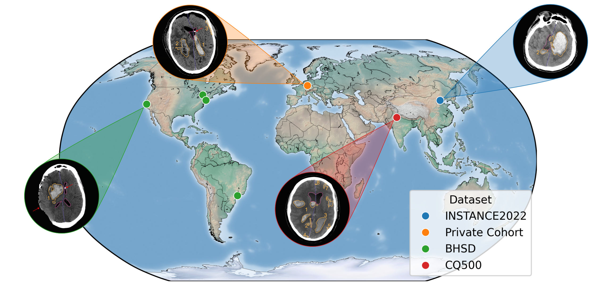

# Federated Scene Graph Prediction

This library is intended to be an optional layer on top of `scene-graph-prediction` to combine it with 
Federated Learning framework `TheODen`.
While we aim to limit the amount of additional code required (e.g. model architectures, losses, metrics...),
the training loop has to be adapted slightly. But that's it!
You can use the existing client/server/command implementation as an example.
For more detail, please check the `TheODen` 
[repository](https://github.com/MECLabTUDA/VoxelSceneGraph/tree/main/theoden).

## Installation

First, follow the [instructions](https://github.com/MECLabTUDA/VoxelSceneGraph/tree/main/scene-graph-prediction) 
to install the `scene-graph-prediction` library.
Then, install `TheODen` as described [here](https://github.com/MECLabTUDA/VoxelSceneGraph/tree/main/theoden).
That's it!

## Model Configuration

The configuration remains _almost_ the same. We add two options:
- a few keys to configure the overall federated training and the server.
- the option to override certain keys for each client individually (e.g. the batch size or which dataset to use). 
  This is also how clients are registered (even if they do not require any change in configuration).

## Scripts

The scripts in the `tools` folder mirror the scripts found in the regular `scene-graph-prediction` library.
You can find two kinds of scripts:
- A **client**. 
It does not do much on its own and just executes whatever the server tells it to. 
That's also why we only need one version
- **Servers**. These decide how the federated training pipeline looks like. We need one per experiment.

## Citation

If you use this library, please cite our papers (**[1](https://arxiv.org/abs/2411.00578)** and 
**[2](https://arxiv.org/abs/2407.21580)**):
```
Sanner, A. P., Stieber, J., Grauhan, N. F., Kim, S., Brockmann, M. A., Othman, A. E., & Mukhopadhyay, A. (2024). 
Federated Voxel Scene Graph for Intracranial Hemorrhage. arXiv [Cs.CV]. Retrieved from https://arxiv.org/abs/2411.00578

Sanner, A. P., Grauhan, N. F., Brockmann, M. A., Othman, A. E., & Mukhopadhyay, A. (2024). 
Voxel Scene Graph for Intracranial Hemorrhage. arXiv [Cs.CV]. Retrieved from https://arxiv.org/abs/2407.21580
```
