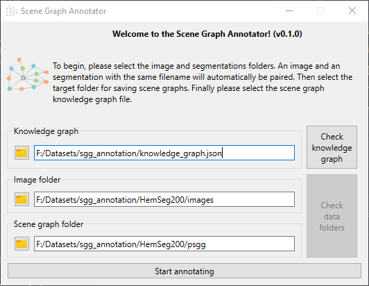
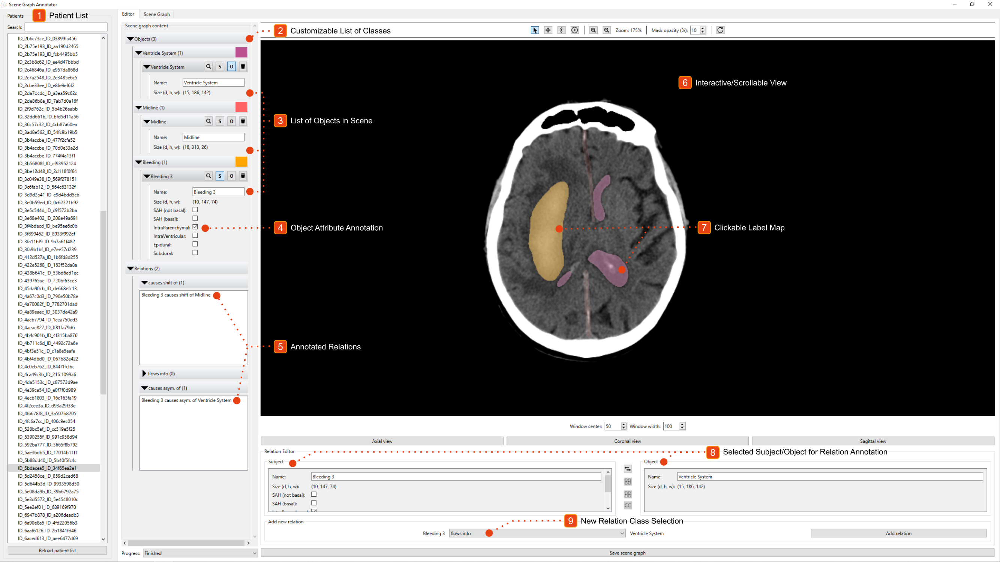

# Scene Graph Annotation

This is the library for our stand-alone tool for Scene Graph annotation, though it can actually be used for more.
We'll give you a short overview of how to prepare the data and how to use our tool.

## Installation

To install as an integrative framework, clone the repo and run:
```bash
pip install -e .
```

If you run into any problems with `Qt6` during the installation, you can try to run these commands manually:
```bash
pip install --upgrade PyQt6-WebEngine-qt6
pip install --upgrade PyQt6-WebEngine
pip install --upgrade PyQt6
pip install --upgrade PyQt6-sip
```

## Data Preparation

If you already have generated Scene Graphs or just want to view our annotation, then you can skip this step.

### Knowledge Graph

Before we can start any annotation process, we need to define what we want to annotate. This includes object classes, 
their attributes, and relation classes. We can also go into finer details, such as:
is there only one object for this class in any given image?

We define all these into a structure which we call a **knowledge graph**. In essence, it allows to make sense of
the annotation content. It is usually stored in a JSON file. While it is tempting to generate it manually, we recommend
creating with a short Python script. Here is an example from our papers:
```python
from scene_graph_api.knowledge import RadiologyImageKG, ObjectClass, RelationRule, BoolAttribute, WhitelistFilter

knowledge_graph = RadiologyImageKG(
    classes=[
        ObjectClass(class_id=1, name="Ventricle System", has_mask=True, is_unique=True),
        ObjectClass(class_id=2, name="Midline", has_mask=True, is_unique=True),
        ObjectClass(
            class_id=3, name="Bleeding",
            attributes=[
                BoolAttribute(attr_id=1, name="SAH (not basal)"),
                BoolAttribute(attr_id=2, name="SAH (basal)"),
                BoolAttribute(attr_id=3, name="Intraparenchymal"),
                BoolAttribute(attr_id=4, name="IntraVentricular"),
                BoolAttribute(attr_id=5, name="Epidural"),
                BoolAttribute(attr_id=6, name="Subdural"),
            ],
            has_mask=True
        ),
    ],
    rules=[
        RelationRule(
            rule_id=1, name="causes shift of", 
            subject_filter=WhitelistFilter([3]), object_filter=WhitelistFilter([2])
        ),
        RelationRule(
            rule_id=2, name="flows into", 
            subject_filter=WhitelistFilter([3]), object_filter=WhitelistFilter([1])
        ),
        RelationRule(
            rule_id=3, name="causes asym. of", 
            subject_filter=WhitelistFilter([3]), object_filter=WhitelistFilter([1])
        ),
    ],
    window_center=50,
    window_width=100,
    default_axis=RadiologyImageKG.ImageAxis.axial
)

knowledge_graph.save("knowledge_graph.json")
```

As a breakdown, we defined:
- Three object classes: Ventricle System, Midline, and Bleeding
- Only the Bleeding class has attributes, which define whether an instance belongs 
to a certain Intracranial Hemorrhage subtype.
- Three relations modeling clinical complications: (Bleeding, causes shift of, Midline), 
(Bleeding, flows into, Ventricle System), and (Bleeding, causes the asymmetry of, Ventricle System).

There are more customization options, which are all documented. So we'll let you play with that.

**Note:** You may have noticed the `RadiologyImageKG` class. It is designed for 3D radiology and can store additional 
information, e.g. the window center/width for display or the default image axis. These are currently only used for
display within our tool. We also have the `NaturalImageKG` to support natural images. The main goal is to add
options for different data types. Maybe in the future, it will be useful for video-support. Who knows...

### Converting Masks to Scene Graphs

We assume that you used appropriate tools to segment your images either into segmentation masks for label maps.
The only step left is using the `sgapi_format_conversion` script to generate the JSON scene graphs:

```bash
sgapi_format_conversion -k [path to your knowledge graph] -i [path to your masks] -o [scene graph output path] -if labelmap -of SceneGraph
```

## Using Our Tool

To start the tool, you can run:
```bash
python annotator.py
```

You should now be greeted by this window:



The current design is mostly _functional_, but it is usable at least... Anyway, you are now prompted to enter three paths:
- To the knowledge graph
- The image folder
- The Scene Graph folder

On the right side, you can also see two buttons that allow you to check that everything is fine.
By pressing on the first one, the tool will try to load the knowledge graph and will report any issue with its content.
This will enable the second button, which locates all images/Scene Graphs and tries to pair them.

At the very bottom, you can see the button that will open the actual annotation window. Click on it to proceed.

Note: if it worked, the paths that you just entered will be saved to a temp folder so that you don't have to enter them each time.

Note: you can also open multiple annotation windows from the main one!



You should now see a window similar to the one above.
To bring an image into view, click on a patient in the list.
Let's now see what we have here:
1. A patient list. You can search for specific names or with regular expressions.
2. Object class list. This is the list of object classes in the selected scene. It is exactly as defined in the knowledge graph.
3. Objects. You can see the three objects in the scene being listed here.
4. Bleeding attributes. Again, as defined in the knowledge graph. Different attribute classes have different widgets types for annotation.
5. Relations. Here you can find all annotated relations. If you hover over one, a button will appear to delete it.
6. Interactive view. You can move it around. You can scroll through slices. Zooming in/out...
7. Clickable objects. Click on a mask to select it.
   - Left-click: select as a relation's subject
   - Right-click: select as a relation's object
   - Click again: unselect as subject/object
8. Selected objects. If you clicked on the masks already, you will find them in this area.
9. Add new relation. Here you can add a new relation based on the subject+object that you have selected. 
The list automatically updates to only contain possible classes (remember the `WhitelistFilter`).

## Some More Tips

1. There are icons next to each object in the list. They are very handy:
   1. Magnifier: show a slice with this object
   2. S: (un)select as subject
   2. O: (un)select as object
   3. Trash bin: delete the object. Though you have cleaned this earlier already
2. Use the toolbar on top of the image to change mouse modes or change the mask opacity
3. There are keybinds:
   1. Tab/Shift+Tab: select the next/previous patient in the list
   2. Ctrl+S: save the current Scene Graph.
   3. In the interactive view:
      1. Ctrl+mouse wheel: change the zoom level
      2. Middle-click then move: scroll through slices
4. Only the **last 5 opened Scene Graphs** are kept in a cache. If you open more, changes will not be saved.

## Any Missing Feature?

If you think that our tool is missing some useful or practical feature, then please let us know by opening an issue.
We'll then see whether it is doable and how we can implement it.

We have a few of our own (but too little time):
- Support for keypoints: list and display them, of course, but also move them around.
- Support for videos: this is both a technical problem and a data representation challenge.
To do this, we need to easily annotate object persistence (i.e. an object being present in multiple frames).
We're not sure which solution is the best yet. If this is of interest to you, create an issue to start a discussion or email us!
